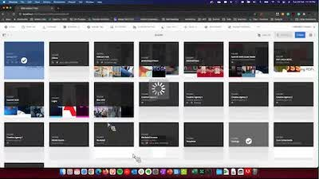

# [!DNL Experience Manager] Kunskapsbyggarinspelningar

Välkommen till Adobe [!DNL Experience Manager] Lektionsbyggare - inspelningar hemma. Dessa är inspelade webbinarier som utformats för att bygga upp din kunskapsbas och maximera din investering i Adobe [!DNL Experience Manager].

## Nyheter

<table>
<tr>
  <td>
    
    

      <a href="https://experienceleague.adobe.com/docs/experience-manager-skill-builder/skill-builder/2020/asset-link.html">
    <strong>[!DNL Asset Link]</strong>
    </a>
    

    

    <em>[!DNL Asset Link] är din inbyggda anslutning till Adobe Creative Cloud.</em>
    

  </td>
  <td>
    
    

    <a href="https://experienceleague.adobe.com/docs/experience-manager-skill-builder/skill-builder/2020/brand-portal.html">
    <strong>Brand Portal</strong>
    </a>
    

    

    <em>Enkel fildelning med interna och externa team.</em>
    

  </td>
  <td>
    
     

      <a href="https://experienceleague.adobe.com/docs/experience-manager-skill-builder/skill-builder/2020/dynamic-media.html">
        <strong>[!DNL Dynamic Media]</strong>
      </a>
    

    

    <em>Automatisera produktionen av resurser för alla kanaler och skärmar.</em>
    

  </td>
</tr>
</table>

>[!TIP]
>
>**Se navigeringen till vänster för inspelningar från tidigare händelser i verktyget Skapa färdigheter**.
